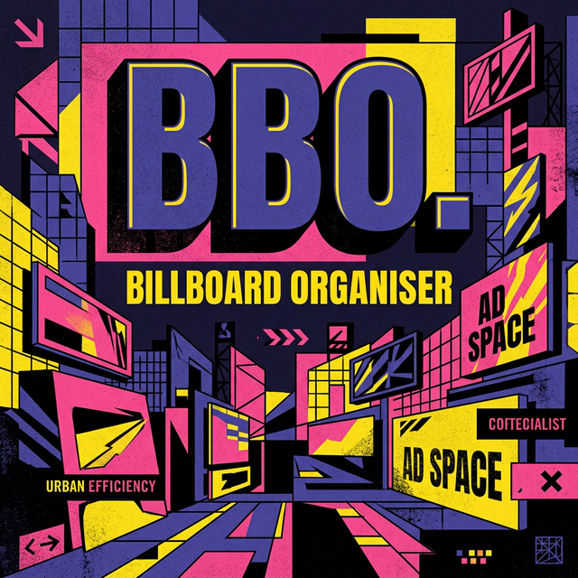

# 🏙️ Billboard Organiser (BBO.)



**The Ultimate Bridge Between Brands and Billboards.**

Billboard Organiser (BBO.) is a high-performance, role-based platform designed to revolutionise the billboard advertising industry. Built with a striking **Neo-Brutalist aesthetic**, it provides a seamless interface for advertisers, asset owners, and administrators to manage high-visibility advertising spaces.

---

## ⚡ Key Highlights

- **🎨 Neo-Brutalist UI**: A bold, high-contrast interface featuring the 'Space Grotesk' typeface, hard black shadows, and vibrant accent colors.
- **� Role-Based Access Control (RBAC)**: Customised dashboards and workflows for **Advertisers**, **Billboard Owners**, and **Administrators**.
- **� Dynamic Search & Booking**: Real-time filtering and detailed view of premium billboard locations.
- **📊 Campaign Analytics**: Track reach, impressions, and performance directly from the dashboard.
- **📱 Edge-to-Edge Responsiveness**: Flawless experience across desktops, tablets, and smartphones.

---

## 🏢 Platform Roles

### 📢 For Advertisers

_Browse. Book. Bloom._

- Search billboards by location or size.
- Manage multi-city campaigns.
- Upload creatives and monitor performance reports.

### 🏠 For Billboard Owners

_List. Lease. Lead._

- List your physical assets with ease.
- Manage bookings and track earnings.
- Optimise inventory with occupancy data.

### 🛡️ For Administrators

_Govern. Guide. Grow._

- Centralised management of users and ad spaces.
- Payment oversight and system integrity reports.
- Global analytics dashboard.

---

## 🛠️ Tech Stack & Architecture

We leverage modern technologies to ensure speed, security, and scalability.

- **Frontend**: React 18 + Vite ⚡
- **Routing**: React Router DOM 6.20 🗺️
- **Icons**: Lucide React ✨
- **Styling**: Custom Neo-Brutalist CSS System (Utility-First) 🎨
- **Typography**: _Space Grotesk_ (Headers) & _Inter_ (Body)

---

## 📐 Project Structure

```bash
BillBoardOrganiser/
├── src/
│   ├── components/      # Reusable UI components (ProtectedRoutes, etc.)
│   ├── context/         # AuthContext for RBAC
│   ├── data/            # Mock Data & Constants
│   ├── layouts/         # Public & Dashboard Layouts
│   ├── pages/
│   │   ├── advertiser/  # Advertiser-specific workflows
│   │   ├── owner/       # Owner-specific workflows
│   │   └── public/      # Home, Search, Login, AdDetails
│   ├── App.jsx          # Route Definitions
│   └── index.css        # The Neo-Brutalist Design System
├── assets/              # Billboard imagery & assets
└── vite.config.js       # Build Configuration
```

---

## 🚀 Getting Started

**Prerequisites:** [Node.js](https://nodejs.org/) installed on your machine.

1.  **Clone the Repository**

    ```bash
    git clone https://github.com/RakshitKashyap1/BillBoardOrganiser.git
    cd BillBoardOrganiser
    ```

2.  **Install Dependencies**

    ```bash
    npm install
    ```

3.  **Run Development Server**

    ```bash
    npm run dev
    ```

4.  **Build for Production**
    ```bash
    npm run build
    ```

---

## 🎨 Design Philosophy: Neo-Brutalism

BBO. isn't just another corporate dashboard. We embrace **Neo-Brutalism** to stand out in a world of rounded corners and soft gradients.

- **Hard Shadows**: Everything has a solid black shadow for tactile feedback.
- **Thick Borders**: 3px borders define every interaction point.
- **Vibrant Palettes**: Indigo (#4338ca), Pink (#ec4899), and Yellow (#fcd34d) create a hierarchy that's impossible to ignore.
- **Typography as UI**: Large, bold headings drive the navigation flow.

---

_Built with passion for the future of Out-Of-Home advertising._ 🌃
